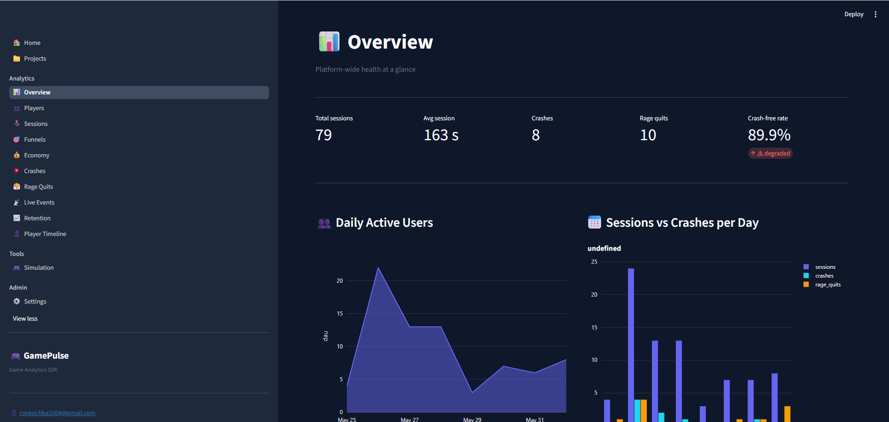
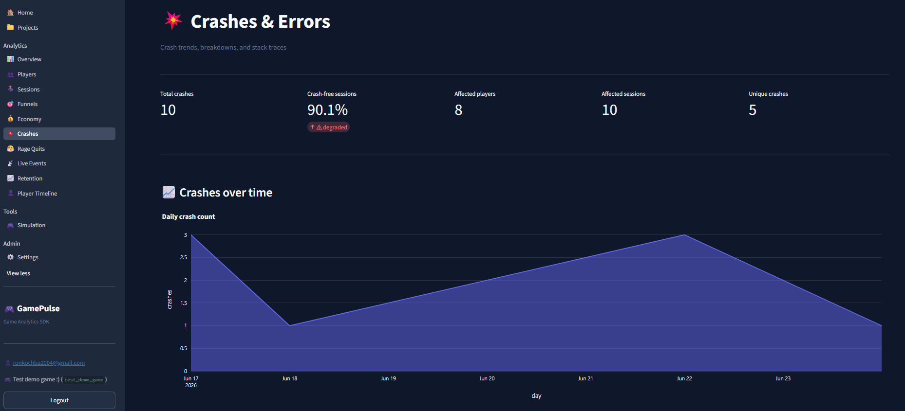
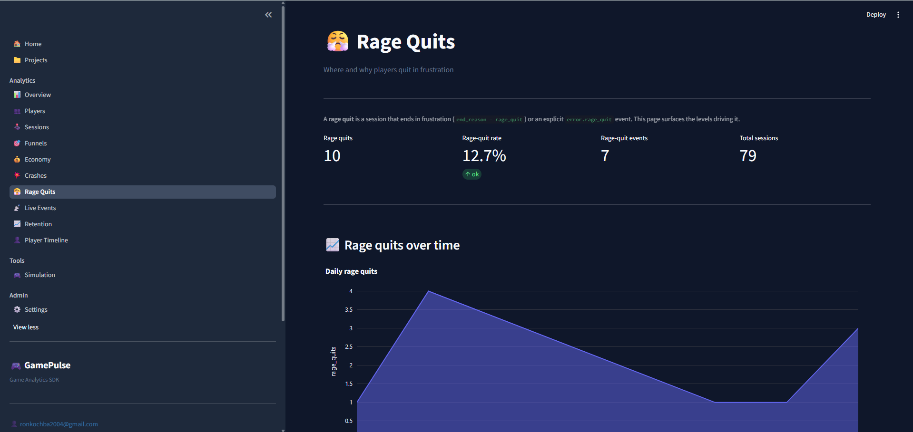
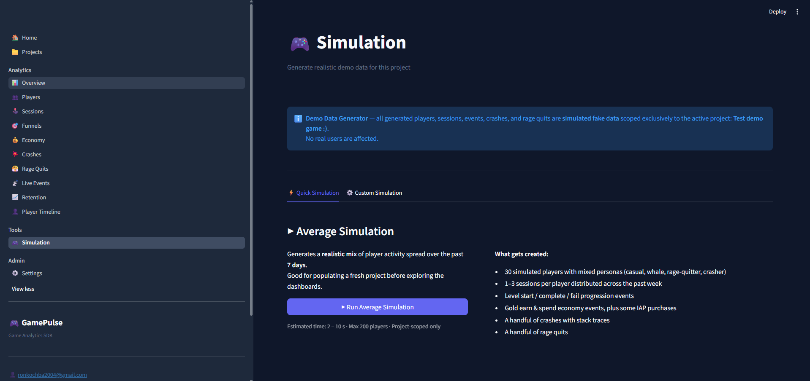

<div align="center">

# 🎮 GamePulse

### Self-hosted game analytics for indie and small-team studios

Track sessions, progression, economy, crashes, and player retention.  
Explore everything through a live dashboard. **You own all the data.**


**[Live Dashboard →](https://gamepulse-dashboard.onrender.com)** · **[Live API →](https://gamepulse-api.onrender.com/docs)**

</div>

---

> **Most game analytics tools are either too expensive, too opaque, or lock your data in a proprietary cloud.**  
> GamePulse gives you the depth of a commercial platform — funnels, retention cohorts, crash fingerprinting, economy flows — running on infrastructure you control, with a Python SDK you can read in an afternoon.  
> Inspired by Firebase Analytics, GameAnalytics, and Sentry — but self-hosted and open.

---

<div align="center">



*DAU trends, crash-free rate, rage-quit rate, and sessions vs crashes per day — the executive summary your team checks after every release.*

</div>

---

## Dashboard preview

### 💥 Crash Analytics



*Crash-free session rate, crashes over time, severity breakdown, per-platform counts, and a fingerprint viewer with full stack traces. Know exactly what broke, when, and for whom — grouped so 500 identical crashes appear as one.*

---

### 😤 Rage Quit Analytics



*Rage-quit rate over time, rage quits by level, a per-level frustration score, and a "biggest hotspot" callout. Surfaces which levels feel unfair — not just hard — so you can tune difficulty before players churn.*

---

### 🎮 Simulation



*Generate a full week of realistic demo data — 30 synthetic players with mixed personas (casual, whale, rage-quitter, crasher) — with one click. Explore every dashboard page before a single real player has launched your game.*

---

## What's in the box

**SDK** — Python. Event batching, retry with exponential backoff, automatic crash capture, persistent offline storage, background flush thread. Zero dependencies beyond `httpx`. Never raises in user code.

**API** — FastAPI. JWT auth for the dashboard, API-key auth for the SDK, per-key rate limiting, idempotent event ingestion (UUID-based dedup), full OpenAPI docs at `/docs`.

**Dashboard** — 12 pages: Overview, Players, Sessions, Funnels, Economy, Crashes, Rage Quits, Live Events, Retention, Player Timeline, Simulation, and Settings. Date-range presets, dimension filters, CSV export throughout.

**Database** — Postgres via Supabase. Custom `gamepulse` schema, indexed for time-range and funnel queries, materialized views for DAU and session stats with automatic background refresh.

**Simulator** — Thread-pool fake-player driver with 4 built-in personas. One-click from the dashboard or scriptable from the terminal.

**Tests** — In-memory fake Supabase lets the full suite run anywhere with zero infrastructure. E2E suite available against a live server.

---

## For game developers

Add GamePulse to your game in minutes:

```bash
pip install gamepulse-sdk
```

```python
import gamepulse

gamepulse.init(
    api_key="gpk_your_key_here",
    project="my-game",
    player_id="user_42",
    api_url="https://your-gamepulse-server.com",
)

with gamepulse.session():
    gamepulse.progression.start(level=3)
    gamepulse.economy.spend(currency="gold", amount=50, item="health_potion")
    gamepulse.progression.complete(level=3, stars=2)
```

Full integration guide, best practices, and all event types: **[SDK Integration Guide →](packages/gamepulse-sdk/README.md)**

What each dashboard page shows and how to read it: **[Dashboard Guide →](docs/dashboard-guide.md)**

---

## Monorepo layout

| Path | What |
|---|---|
| `packages/gamepulse-core` | Shared Pydantic models, enums, schemas |
| `packages/gamepulse-sdk` | Python SDK (`import gamepulse`) |
| `packages/gamepulse-simulator` | Fake-player traffic generator |
| `examples/demo-game` | Interactive Tkinter demo app using the SDK |
| `services/api` | FastAPI ingestion + query API |
| `apps/dashboard` | Streamlit + Plotly analytics dashboard |
| `db/migrations` | Supabase Postgres SQL migrations |
| `tests/` | Core / SDK / API / e2e test suites |
| `docs/` | Architecture, deployment, and dashboard guides |

The workspace is managed by **uv** — a single `uv sync --all-packages` installs everything from one lockfile.

---

## Quickstart (10 minutes)

### 1. Prerequisites

- Python 3.11 or 3.12
- [uv](https://docs.astral.sh/uv/) — `pip install uv` or `brew install uv`
- A [Supabase](https://supabase.com) project (free tier is fine)

### 2. Clone and install

```bash
git clone <this-repo>
cd Gamepulse_SDK_Project
uv sync --all-packages
```

### 3. Configure environment

```bash
cp .env.example .env
# Edit .env — see "Environment variables" below
```

### 4. Apply database migrations

Open **Supabase Dashboard → SQL Editor** and run each file in order:

```
db/migrations/0001_init.sql  through  db/migrations/0009_refresh_fn_security_definer.sql
```

Or via psql:

```bash
for f in db/migrations/*.sql; do psql "$SUPABASE_DB_URL" -f "$f"; done
```

### 5. Run the API

```bash
make api
# or: uv run uvicorn app.main:app --reload --app-dir services/api --port 8000
```

OpenAPI docs at <http://localhost:8000/docs>.

### 6. Run the dashboard

```bash
make dashboard
# or: uv run streamlit run apps/dashboard/Home.py
```

Open <http://localhost:8501>, create an account, and create your first project.

### 7. Generate demo data

**From the dashboard (easiest):** Simulation → Run Average Simulation.

**From the terminal:**

```bash
make simulate
# or:
uv run python -m simulator --players 25 --duration 60 \
    --api-url http://localhost:8000 \
    --api-key gpk_your_key \
    --project your-project-slug
```

Every dashboard page will be fully populated immediately.

### 8. Or drive it live with the demo game

For a hands-on demo, run the **[interactive demo app](examples/demo-game/README.md)** —
a small desktop app whose buttons (Start Level, Spend Gold, Trigger Crash, Rage
Quit, …) each call the real SDK so you can watch the dashboard update live:

```bash
uv run python examples/demo-game/demo_game.py
```

---

## Environment variables

| Variable | Used by | Notes |
|---|---|---|
| `SUPABASE_URL` | API | e.g. `https://abc.supabase.co` |
| `SUPABASE_SERVICE_ROLE_KEY` | API | **Server-only** — never expose to clients |
| `SUPABASE_ANON_KEY` | Dashboard | For Supabase Auth on the frontend |
| `SUPABASE_JWT_SECRET` | API | For JWT verification |
| `GAMEPULSE_API_HOST` / `_PORT` | API | Default `0.0.0.0:8000` |
| `GAMEPULSE_API_LOG_LEVEL` | API | Default `INFO` |
| `GAMEPULSE_API_CORS_ORIGINS` | API | Comma-separated; default `*` |
| `GAMEPULSE_API_RATE_LIMIT_PER_MIN` | API | Per-API-key sliding window; default `600` |
| `GAMEPULSE_ANALYTICS_REFRESH_INTERVAL_S` | API | MV refresh interval; default `600` (0 = off) |
| `GAMEPULSE_API_URL` | SDK / simulator | Where to send events |
| `GAMEPULSE_API_KEY` | SDK / simulator | Your project's SDK key |
| `GAMEPULSE_PROJECT_SLUG` | Simulator | Your project slug |
| `GAMEPULSE_DASHBOARD_API_URL` | Dashboard | Base URL of the API |

---

## Architecture

```
 ┌──────────────┐  HTTPS   ┌──────────────────┐  SQL   ┌──────────────┐
 │  Game / SDK  │ ───────► │   FastAPI API     │ ─────► │ Supabase PG  │
 └──────────────┘          │  (ingest + query) │ ◄───── │              │
                           └────────┬──────────┘        └──────┬───────┘
                                    │ /v1/query/*               │
                                    ▼                           │
                           ┌──────────────────┐                 │
                           │    Streamlit     │ ◄─── reads ─────┘
                           │    Dashboard     │
                           └──────────────────┘
 ┌──────────────┐
 │  Simulator   │ ─── uses SDK ──►
 └──────────────┘
```

More detail in [`docs/architecture.md`](docs/architecture.md).

---

## Testing

The default suite uses an **in-memory fake Supabase client** — runs anywhere with zero infrastructure:

```bash
uv run pytest -q
```

| Suite | What it covers |
|---|---|
| `tests/core/` | Shared model roundtrips |
| `tests/sdk/` | SDK smoke tests and offline storage |
| `tests/api/` | FastAPI routes via TestClient + fake Supabase |
| `tests/e2e/` | Full pipeline against a live API + real Supabase (skipped unless `GAMEPULSE_E2E_API_URL` is set) |

```bash
# End-to-end (requires make api running):
GAMEPULSE_E2E_API_URL=http://localhost:8000 \
GAMEPULSE_E2E_API_KEY=your_key_here \
uv run pytest -q tests/e2e
```

---

## Troubleshooting

**`401 Missing X-GamePulse-Key`** — check `GAMEPULSE_API_KEY` is set in your environment.

**`401 Invalid API key`** — the key doesn't match any project. Go to **Projects** in the dashboard to copy or rotate it.

**Dashboard shows empty charts** — go to **Simulation → Run Average Simulation**, or run `make simulate`.

**`relation "gamepulse.events" does not exist`** — migrations haven't been applied. Run all files in `db/migrations/` in numbered order.

**Supabase RLS errors** — the API uses the service role key, which bypasses RLS by design. Ensure `SUPABASE_SERVICE_ROLE_KEY` (not the anon key) is in `.env`.

**`make` not available on Windows** — use the underlying commands directly; the Makefile is a thin wrapper.

**SDK seems to drop events** — set `debug=True` in `gamepulse.init()` and check the `gamepulse` logger. The SDK never raises in user code; all failures are logged silently by default.

---

## Further reading

| Document | What it covers |
|---|---|
| [SDK Integration Guide](packages/gamepulse-sdk/README.md) | How to add GamePulse to your game |
| [Dashboard Guide](docs/dashboard-guide.md) | What each dashboard page shows and how to use it |
| [Architecture](docs/architecture.md) | System design, auth model, scaling notes, analytics aggregation |
| [Deployment](docs/deployment.md) | Render, Fly.io, Railway, production checklist |
| [Technical debt & roadmap](docs/tech_debt.md) | Known limitations and Phase 2 plans |
