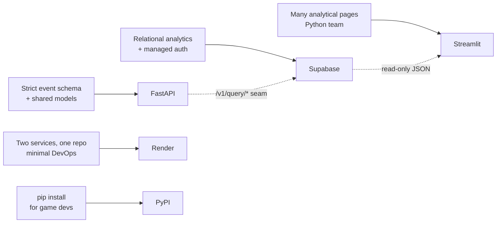

# Architecture Decision Records

Each record captures a significant technology choice: the decision, the context that
forced it, the alternatives considered, the consequences (good and bad), and the
escape hatch if the decision needs to be revisited. Records are immutable once
accepted; a superseding record is added rather than editing history.

---

## ADR-001 — FastAPI for the backend

**Status:** Accepted

**Context.** The backend has two distinct workloads: a high-volume, latency-sensitive
ingestion endpoint and a set of read-heavy analytics queries for the dashboard. It
must validate a strict event schema, expose self-documenting endpoints, and be
approachable for a small team.

**Decision.** Use **FastAPI**.

**Alternatives considered.**
- *Flask / Django REST* — mature, but request validation is bolted on and async
  support is secondary.
- *Node/Express* — would split the stack across two languages; the event models
  already live in Python (`gamepulse-core`).

**Consequences.**
- **Good:** Pydantic validation reuses the exact models the SDK serialises, so the
  wire contract cannot drift. Automatic OpenAPI docs at `/docs`. Async-native request
  handling. Minimal boilerplate.
- **Bad / accepted:** The underlying Supabase client is synchronous, so the async
  handlers currently wrap sync calls. Migrating to `asyncpg` is the documented Phase-2
  path.

**Escape hatch.** Handlers are thin; the storage layer is isolated behind
repositories, so the DB driver can change without rewriting routes.

---

## ADR-002 — Supabase (Postgres) for storage

**Status:** Accepted

**Context.** The MVP needs a relational store with JSONB, strong indexing, a managed
free tier, and built-in authentication for the dashboard — without running database
infrastructure ourselves.

**Decision.** Use **Supabase** (managed Postgres) as both the database and the
dashboard's auth provider.

**Alternatives considered.**
- *Self-hosted Postgres* — full control, but operational burden (backups, upgrades,
  auth) the project explicitly wants to avoid.
- *MongoDB* — flexible documents, but the analytics are inherently relational
  (joins across projects/players/sessions/events) and benefit from SQL aggregation
  and composite indexes.
- *A dedicated analytics store (ClickHouse/BigQuery)* — better at scale, but heavier
  to operate and overkill for a small studio's volume.

**Consequences.**
- **Good:** Postgres gives JSONB payloads *and* relational integrity, generated
  columns (`duration_s`), materialized views, and rich indexing. Supabase bundles
  managed hosting plus JWT auth, removing two infrastructure concerns at once.
- **Bad / accepted:** Free-tier projects pause after 7 days of inactivity; the `events`
  table will need partitioning at scale. Both are documented operationally.

**Escape hatch.** The `/v1/query/*` boundary means a columnar store can be swapped in
behind the API later without touching the SDK or dashboard.

---

## ADR-003 — Streamlit for the dashboard

**Status:** Accepted

**Context.** The dashboard is data-visualisation-heavy (a dozen analytical pages) and
is built by a Python team. Time-to-build and ease of iteration matter more than
pixel-level UI control.

**Decision.** Use **Streamlit** with Plotly charts.

**Alternatives considered.**
- *React + a charting library* — maximum control, but a second language/toolchain and
  far more code for what are essentially query-and-chart pages.
- *Dash* — Python-native, but more boilerplate than Streamlit for this scope.
- *Grafana / Metabase* — fast to stand up, but hard to tailor the bespoke analytics
  (per-level frustration scoring, crash fingerprinting) the product is about.

**Consequences.**
- **Good:** A full analytical page is a few dozen lines of Python. `@st.fragment`
  enables the live-updating Events page without WebSockets. Reuses the team's existing
  language and the `gamepulse-core` models.
- **Bad / accepted:** Less control over layout; every interaction re-runs the script
  (mitigated with caching and fragments). Not suited to a high-customisation public
  product UI.

**Escape hatch.** The dashboard only reads `/v1/query/*`, so it can be replaced by a
custom frontend against the same API.

---

## ADR-004 — Render for deployment

**Status:** Accepted

**Context.** The project needs to deploy two services (API and dashboard) from one
repo, support Dockerfiles, offer a usable free tier, and require minimal DevOps.

**Decision.** Deploy with a **Render Blueprint** (`render.yaml`) defining both
services.

**Alternatives considered.**
- *Streamlit Community Cloud* — free and trivial for the dashboard, but cannot install
  the local `gamepulse-core` workspace package and only hosts one service.
- *Fly.io* — no cold starts on the free tier, but more configuration; kept as a
  documented alternative for an always-on API.
- *Railway / Heroku* — viable, but Render's single-file Blueprint deploys both
  services together with the least ceremony.

**Consequences.**
- **Good:** One `render.yaml` provisions API and dashboard together. Native Dockerfile
  support means dev/prod parity. Free tier is sufficient for demos. Health checks and
  automatic redeploys on push are built in.
- **Bad / accepted:** Free services cold-start after 15 minutes idle (mitigated with
  UptimeRobot pings). Free tier requires a public repo.

**Escape hatch.** Services are plain Docker images; the same containers run on Fly.io
or Railway (both documented in [`docs/deployment.md`](deployment.md)).

---

## ADR-005 — PyPI for SDK distribution

**Status:** Accepted

**Context.** Game developers integrate the SDK with `pip install`. Distribution must
be standard, versioned, and not require access to this repository.

**Decision.** Publish **`gamepulse-sdk`** and its dependency **`gamepulse-core`** to
**PyPI** as standard wheels + sdists, built with Hatchling.

**Alternatives considered.**
- *Install from Git* — works, but couples users to the repo layout, has no semantic
  versioning, and breaks Streamlit Community Cloud and other restricted environments.
- *Private index* — unnecessary for an open, MIT-licensed SDK and adds friction for
  adopters.
- *Vendoring* — pushes dependency management onto every user.

**Consequences.**
- **Good:** `pip install gamepulse-sdk` is the universal, expected workflow. Semantic
  versioning and proper metadata (license, classifiers, `py.typed`) make the package
  discoverable and tooling-friendly. Decouples users from the monorepo.
- **Bad / accepted:** Two packages must be released in dependency order
  (`gamepulse-core` first). Releasing requires the build/validate/upload discipline
  documented in the release process.

**Escape hatch.** The packages are standard PEP 517 builds; they can also be installed
from a built wheel or a private index without code changes.

---

## Decision map

See [Technical Debt & Roadmap](tech_debt.md) for decisions explicitly deferred to a
later phase.
