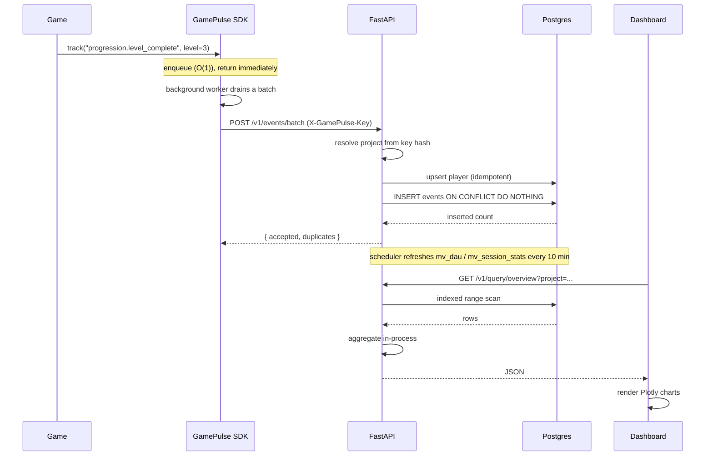

# Analytics Pipeline

This document traces a telemetry event from the game all the way to a rendered
dashboard chart, then analyses the complexity of every metric the dashboard
computes. The implementation lives in
[`services/api/app/services/analytics_service.py`](../services/api/app/services/analytics_service.py)
and the ingest path in
[`services/api/app/services/ingest_service.py`](../services/api/app/services/ingest_service.py).

---

## End-to-end event flow

### Ingestion (write path)

`ingest_batch()` does two database operations per request:

1. **Upsert the player** by `(project_id, external_id)` — O(1) indexed upsert.
2. **Insert the event batch** with `ON CONFLICT (project_id, event_id) DO NOTHING`.
   The client-generated `event_id` makes the whole batch **idempotent**: a retried
   batch inserts zero duplicate rows, and the response reports `accepted` vs
   `duplicates` so the SDK can confirm delivery.

For a batch of `B` events the ingest cost is `O(B log N)` — each insert is a B-tree
insertion against the unique index over `N` existing rows — plus one player upsert.

### Aggregation (read path)

Two strategies coexist:

- **Pre-aggregated** — the Overview page's DAU and session stats are also available
  as materialized views (`mv_dau`, `mv_session_stats`), refreshed on a timer by the
  in-process scheduler (`app/scheduler.py`, default every 600 s). Reads become an
  indexed lookup of a few per-day rows.
- **Live aggregation** — every other page issues an indexed range scan over the
  query window and aggregates in the API process using dictionaries and `Counter`s.
  This trades a little CPU for always-fresh numbers and zero refresh lag.

---

## Per-metric complexity

Notation: `N` = total rows in a table, `k` = rows returned within the query window
(the time-bounded subset actually scanned), `P` = distinct players, `L` = number of
levels, `D` = days in the window. All queries are project-scoped and use a
`(project_id, <time> desc)` index, so fetching `k` rows costs `O(log N + k)`.

| Metric (page) | DB work | In-process work | Time | Space |
|---|---|---|---|---|
| **Overview** (DAU, crash-free, sessions) | 1 range scan of sessions | one pass, hashing players per day | O(log N + k) | O(P + D) |
| **Live Events** (recent tail) | 1 indexed `LIMIT n` scan | none (passthrough) | O(log N + n) | O(n) |
| **Sessions analytics** | 2 scans (window + recent) | one pass + sort for median | O(log N + k log k) | O(k) |
| **Players summary** | 1 indexed `LIMIT` scan | 3 `Counter`s over rows | O(log N + k) | O(k) |
| **Progression funnel** | 2 type-filtered scans | per-level set union | O(log N + k) | O(P + L) |
| **Economy summary** | 1 type-filtered scan | one pass accumulation | O(log N + k) | O(items) |
| **Crash analytics** | 2 scans + 1 player lookup (`IN`) | group by fingerprint | O(log N + k) | O(unique fingerprints) |
| **Rage-quit analytics** | 3 scans (sessions + 2 event types) | per-level scoring + sort | O(log N + k + L log L) | O(L) |
| **Retention cohort** | 1 sessions scan | first-seen + day-set membership | O(log N + k·D) | O(P·D) |
| **Player timeline** | 4 indexed `LIMIT` scans | none (passthrough) | O(log N + n) | O(n) |

### Notable computations

**Crash grouping.** `crash_analytics()` builds a `fingerprints` dict in a single
pass over the `k` crash rows, tracking `count`, `first_seen`, and `last_seen` per
fingerprint — `O(k)` time, `O(unique fingerprints)` space. Platform and app-version
are resolved with one batched `IN (...)` lookup against `players` rather than a
per-row join.

**Retention.** `retention_cohort()` is the most expensive metric. For each player it
records the set of active days, then for each cohort date checks Day-N membership
across `max_day_n` offsets — `O(k·D)` in the window. Because the window is bounded
(default 14 cohort days, 7 day-N offsets) this is small in practice, but it is the
one query that grows with both players and window width.

**Funnel.** Unique players per level use Python `set`s keyed by level; `starts` is a
set (distinct players) while `attempts` is a `Counter` (includes retries), giving
both completion rate and average-attempts-per-player in one pass.

---

## Why aggregate in the application, not in SQL?

The MVP deliberately fetches raw rows and aggregates in Python rather than pushing
`GROUP BY` into Postgres. The trade-off:

- **Pro:** the same code path runs against the in-memory fake Supabase client in
  tests (no SQL engine required), keeping the test suite infrastructure-free; and
  the aggregation logic is readable and unit-testable.
- **Con:** it moves `O(k)` of work into the API process and transfers `k` rows over
  the wire. Each scan is capped (50,000 for events, 100,000 for sessions) to bound
  worst-case memory and latency.

The `/v1/query/*` boundary is the seam where this can change: a production
deployment can replace in-process aggregation with SQL `GROUP BY`, materialized
views, or a columnar store (ClickHouse/BigQuery) without touching the SDK or the
dashboard. See [Architecture Decision Records](adr.md) and
[Technical Debt & Roadmap](tech_debt.md).

---

## Staleness and freshness

| Surface | Freshness |
|---|---|
| Live Events, Player Timeline | Always live (raw row reads) |
| Funnels, Economy, Sessions, Crashes, Retention, Rage Quits | Always live (window scans) |
| Overview DAU / session-stat trends (via materialized views) | Up to `refresh_interval_s` old (default 10 min) |

Set `GAMEPULSE_ANALYTICS_REFRESH_INTERVAL_S=0` to disable the background refresh
(used in tests). See [Performance & Complexity](performance.md) for scaling
behaviour and [Database Design](database-design.md) for the underlying schema.
