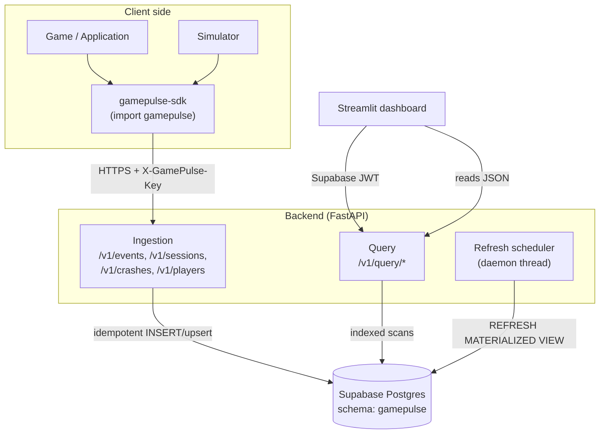
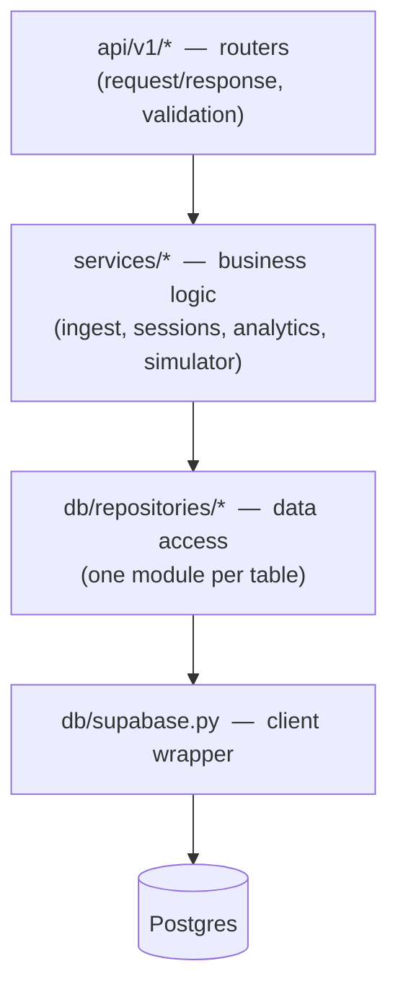
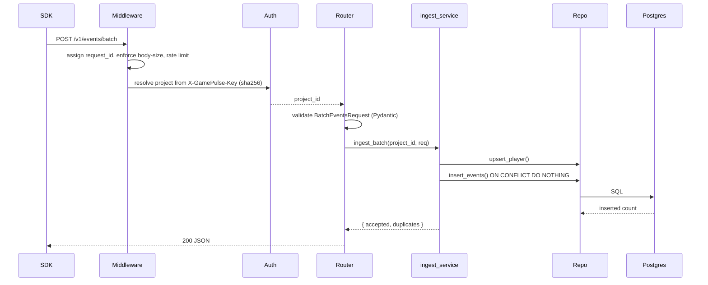
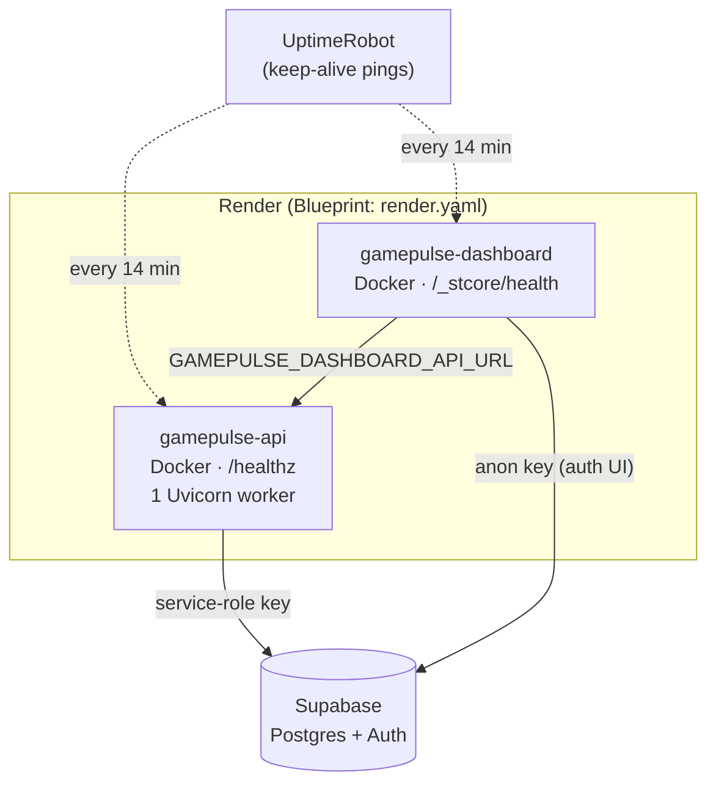

# System & Backend Architecture

GamePulse is a monorepo of cooperating components: a Python SDK that games embed, a
FastAPI ingestion-and-query backend, a Supabase Postgres store, a Streamlit
dashboard, and a simulator. This document covers the system-level component map, the
backend's internal layering, the request lifecycle, and the deployment topology.

It is the hub for the deeper documents:
[SDK Architecture](sdk-architecture.md),
[Database Design](database-design.md),
[Analytics Pipeline](analytics-pipeline.md),
[Simulation System Design](simulation-design.md),
[Performance & Complexity](performance.md),
[Non-Functional Requirements](non-functional-requirements.md), and
[Architecture Decision Records](adr.md).

---

## System architecture

### Components

- **packages/gamepulse-core** — Pydantic models, enums, schemas (single source of truth).
- **packages/gamepulse-sdk** — public `import gamepulse` API, background queue, retrying HTTP transport, crash hook.
- **packages/gamepulse-simulator** — thread-pool driver that runs the SDK as N synthetic players.
- **services/api** — FastAPI app with `/v1/events`, `/v1/sessions`, `/v1/crashes`, `/v1/players/identify`, `/v1/query/*`.
- **apps/dashboard** — Streamlit pages that call the query API.
- **db/migrations** — numbered SQL migrations applied to Supabase.

---

## Backend architecture

The FastAPI service (`services/api/app`) is layered so that routing, business logic,
and storage are independently testable and replaceable:

| Layer | Directory | Responsibility |
|---|---|---|
| Routing | `api/` (`v1/ingest.py`, `query.py`, `sessions.py`, `crashes.py`, `manage.py`, ...) | HTTP surface; Pydantic validation; status codes |
| Services | `services/` | Business logic: `ingest_service`, `session_service`, `analytics_service`, `simulator_service` |
| Repositories | `db/repositories/` | One module per table; the only code that builds queries |
| Client | `db/supabase.py` | Supabase client construction (service-role key) |
| Cross-cutting | `middleware/`, `security/`, `scheduler.py` | Request ID, logging, rate limit, body-size limit; auth; MV refresh |

This separation is what lets the entire test suite run against an **in-memory fake
Supabase client** with no database: tests substitute the client at the `db` layer
and exercise the real routing, services, and repositories above it.

### Request lifecycle (ingestion)

Middleware (`middleware/`) runs in order on every request: request-ID tagging,
structured logging, body-size enforcement (256 KB → HTTP 413), and per-API-key rate
limiting. Authentication resolves the project from the hashed API key before the
route handler runs.

---

## Auth

- **SDK → API**: `X-GamePulse-Key` header; key is hashed (sha256) in `projects.api_key_hash`.
- **Dashboard → API**: Supabase JWT (HS256) verified against `SUPABASE_JWT_SECRET`.
- API process holds the **service role** key for Supabase.

## Idempotency

Each event carries a client-generated `event_id` UUID. The DB has
`UNIQUE (project_id, event_id)`, so retried batches are safe. The insert uses
`ON CONFLICT (project_id, event_id) DO NOTHING` and reports `accepted` vs
`duplicates`, so the SDK can confirm delivery even after a retry. See
[Analytics Pipeline](analytics-pipeline.md) for the full write path.

## Analytics aggregation

Dashboard pages that show DAU and session-level trends read from two materialized
views: `gamepulse.mv_dau` and `gamepulse.mv_session_stats`.

**Refresh mechanism** — the FastAPI process starts a daemon background thread
(`app/scheduler.py`) on startup that calls the Supabase RPC function
`public.gp_refresh_analytics_views()` (which wraps
`gamepulse.refresh_analytics_views()`) on a configurable interval.

| Setting | Env var | Default |
|---------|---------|---------|
| Refresh interval | `GAMEPULSE_ANALYTICS_REFRESH_INTERVAL_S` | 600 s (10 min) |

Set the env var to `0` to disable automatic refresh (useful in test environments).

**Staleness** — dashboard data can be up to `refresh_interval_s` seconds old.
Crash-free rate, session counts, and DAU figures are derived from the
materialized views. Raw event queries (Live Events, Player Timeline) always
read live rows.

**Limitations** — the scheduler is in-process and per-worker. With multiple
Uvicorn workers each worker refreshes independently (harmless but redundant).
For a production multi-worker setup, move the refresh job to a dedicated cron
worker or use `pg_cron` inside Postgres.

## Scaling notes

- `events` is indexed for time-range and type-range queries; ready for monthly partitioning via pg_partman.
- Read traffic for the dashboard goes through materialized views (`mv_dau`, `mv_session_stats`).
- The SDK transport is pluggable — swap HTTP for Kafka/SQS later without touching event types.
- All dashboard reads are via `/v1/query/*` — the storage engine can change to ClickHouse/BigQuery later.

Full complexity and scaling analysis is in [Performance & Complexity](performance.md).

---

## Deployment architecture

Both services are containerised and deployed together from a single Render Blueprint
(`render.yaml`). The dashboard talks to the API over its public URL; the API talks to
Supabase with the service-role key.

Live URLs:

- **API:** https://gamepulse-api.onrender.com
- **Dashboard:** https://gamepulse-dashboard.onrender.com

Key deployment properties:

- **Single worker by design** — keeps the in-memory rate limiter and the refresh
  scheduler correct (see [Non-Functional Requirements](non-functional-requirements.md)).
- **Docker for dev/prod parity** — the same images run locally via
  `docker-compose.yml`.
- **Health checks** — `/healthz` (API) and `/_stcore/health` (dashboard) let the
  platform detect and restart unhealthy containers.
- **Cold-start mitigation** — UptimeRobot pings both health endpoints every 14
  minutes to keep free-tier services warm.

Full step-by-step instructions, environment variables, and alternative platforms
(Fly.io, Railway) are in the [Deployment Guide](deployment.md). The reasoning behind
each platform choice is in [Architecture Decision Records](adr.md).
