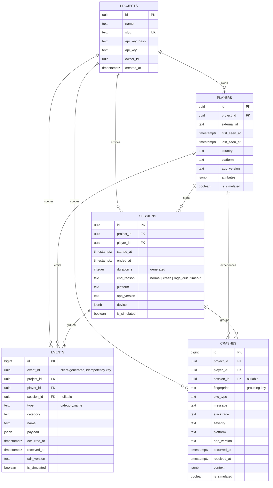
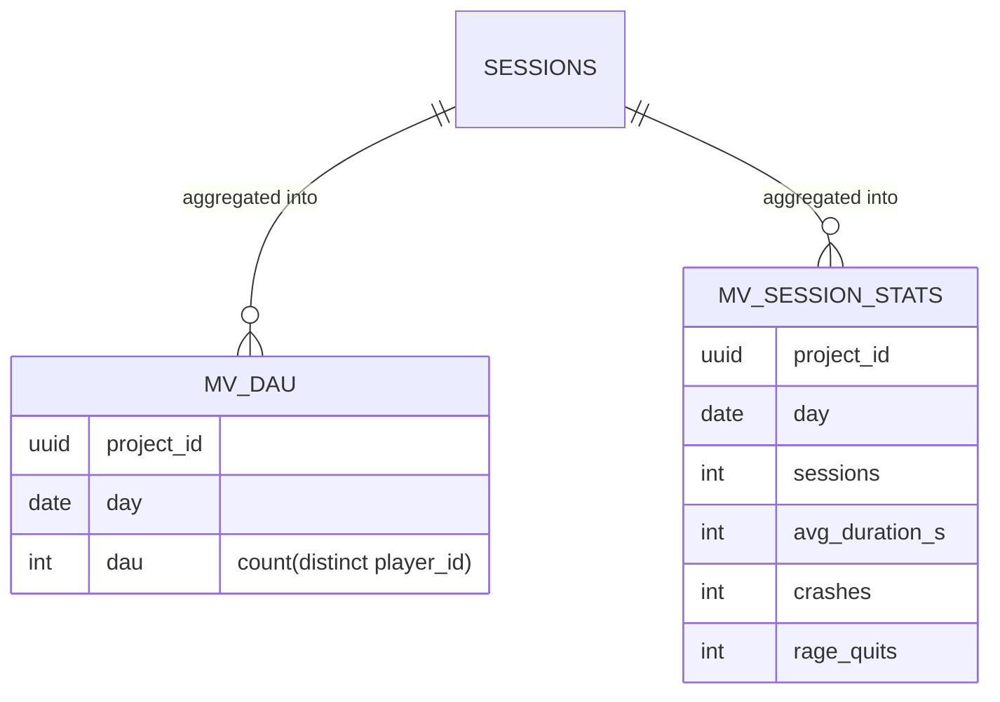

# Database Design

GamePulse stores all telemetry in a dedicated `gamepulse` schema inside a single
Supabase Postgres database. The design favours a small number of wide,
append-mostly tables with composite indexes tuned for the project-scoped,
time-ranged queries the dashboard issues.

This document describes the entity-relationship model, each table, the indexing
strategy, and the access patterns the schema is optimised for. The authoritative
definitions are the numbered SQL files in [`db/migrations/`](../db/migrations/).

---

## Entity-relationship diagram

### Materialized views (derived, not base tables)

Two materialized views pre-aggregate the `sessions` table for the Overview page.
They are not entities in the ER model — they are refreshed projections of
`sessions` (see [Analytics Pipeline](analytics-pipeline.md)).

### A note on "rage quits"

There is deliberately **no `rage_quits` table**. A rage quit is a derived concept
captured two complementary ways, which the dashboard cross-references:

1. **Session-level** — a session whose `end_reason = 'rage_quit'`. This drives the
   rage-quit *rate* (rage sessions / total sessions).
2. **Event-level** — an event of `type = 'error.rage_quit'` whose `payload.level`
   records *where* the player quit. This drives the per-level frustration scoring.

Modelling rage quits as an `end_reason` value and an event type (rather than a
separate table) keeps the schema normalised and lets the same indexes serve both
the rage-quit and the general session/event queries.

---

## Tables in detail

### `projects`
The tenant boundary. Every other row carries a `project_id`, and every query is
filtered by it. `slug` is unique and human-facing; `api_key_hash` stores the
SHA-256 of the SDK key (the key itself is never stored in hashed-only deployments,
though `api_key` holds the raw value for the MVP dashboard "copy key" feature).
`owner_id` links a project to a Supabase Auth user.

### `players`
One row per `(project_id, external_id)` — enforced by a unique constraint, which
makes ingestion an idempotent upsert. `first_seen_at` / `last_seen_at` bound the
player's lifetime; `country`, `platform`, and `app_version` denormalise the latest
known device facts for fast breakdowns. `attributes` is a free-form JSONB bag set
via `identify()`.

### `sessions`
One row per gameplay session. `duration_s` is a **generated column** —
`extract(epoch from (ended_at - started_at))` — so session length is computed by
Postgres at write time and never has to be derived in application code. `end_reason`
is the single most important analytical dimension: it feeds crash-free rate,
rage-quit rate, and the end-reason breakdown.

### `events`
The high-volume table and the analytical core. `id` is a `bigserial` for cheap
ordering and pagination; `event_id` is the **client-generated UUID** used for
idempotency. `type` is the canonical `category.name` string (e.g.
`progression.level_complete`); `category` and `name` are denormalised from it so
queries can filter on either axis. `payload` is JSONB and carries the event-specific
fields (level, currency, amount, ...).

### `crashes`
Separate from `events` because crashes carry a large `stacktrace` and have their own
query patterns (grouping by `fingerprint`). The `fingerprint` is a stable hash of
`exc_type + normalised message`, so 500 identical crashes collapse into one group.

---

## Indexing strategy

Every index is **composite and project-first**, because no query ever crosses
project boundaries. Leading with `project_id` lets a single index serve both the
tenant filter and the secondary sort/filter.

| Table | Index | Serves |
|---|---|---|
| `players` | `(project_id, last_seen_at desc)` | Players page, active-player lists |
| `players` | `(project_id, is_simulated)` | "Hide simulated data" filter, bulk delete |
| `sessions` | `(project_id, started_at desc)` | Overview, Sessions, Retention, Rage Quits |
| `sessions` | `(player_id, started_at desc)` | Player Timeline session history |
| `sessions` | `(project_id, is_simulated)` | Simulated-data filter / deletion |
| `events` | `(project_id, occurred_at desc)` | Live Events tail |
| `events` | `(project_id, type, occurred_at desc)` | Funnel, Economy (type-filtered scans) |
| `events` | `(player_id, occurred_at desc)` | Player Timeline event history |
| `events` | `(session_id, occurred_at desc)` | Per-session event lookups |
| `events` | GIN `(payload)` | Ad-hoc JSONB payload filters |
| `events` | `(project_id, is_simulated)` | Simulated-data filter / deletion |
| `crashes` | `(project_id, fingerprint, occurred_at desc)` | Crash grouping |
| `crashes` | `(project_id, occurred_at desc)` | Crashes time series |
| `crashes` | `(player_id, occurred_at desc)` | Player Timeline crash history |

The `UNIQUE (project_id, event_id)` constraint on `events` is itself a B-tree index;
it both enforces idempotency and accelerates conflict resolution during the
`ON CONFLICT DO NOTHING` upsert (see [Analytics Pipeline](analytics-pipeline.md)).

---

## Access patterns

The schema is optimised for three shapes of query, all project-scoped:

1. **Bounded recent tail** — `ORDER BY occurred_at DESC LIMIT n` (Live Events,
   recent sessions, recent crashes). Served directly by the leading composite
   indexes; cost is `O(log N + n)`.
2. **Time-window aggregate scan** — `WHERE occurred_at >= since` over a 7-to-30-day
   window, then aggregated in the API process (funnels, economy, retention).
   Index range scan returns `k` rows; aggregation is `O(k)`.
3. **Pre-aggregated lookup** — the Overview page reads `mv_dau` /
   `mv_session_stats`, turning a full-window session scan into an indexed read of a
   handful of per-day rows.

Writes are **append-mostly**: events and crashes are insert-only; players are
upserted; sessions are inserted on start and updated once on end. There are no
in-place updates on the hot path, which keeps the tables HOT-update-friendly and
the indexes cheap to maintain.

See [Performance & Complexity](performance.md) for the full Big-O treatment of each
query, and [`docs/architecture.md`](architecture.md) for how the API layers sit on
top of this schema.
