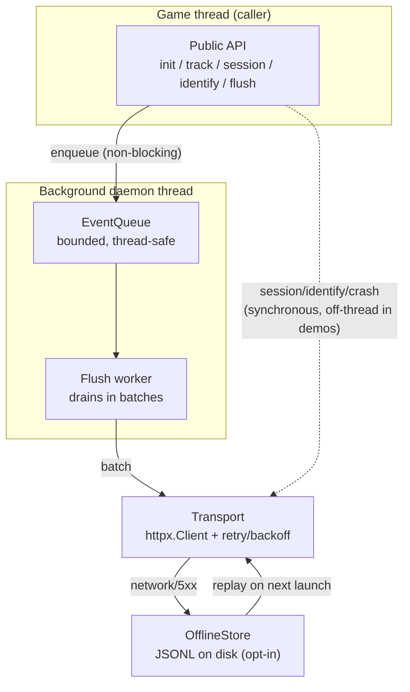

# SDK Architecture

This document describes the internal design of the GamePulse Python SDK
(`packages/gamepulse-sdk`). For the public API and usage, see the
[SDK Integration Guide](../packages/gamepulse-sdk/README.md) and the
[SDK Quick Reference](sdk-usage.md).

The guiding constraint is that **the SDK must never raise into the host game**.
Every public call either succeeds or fails silently-but-logged; all I/O happens off
the caller's thread; and a misbehaving network never blocks gameplay.

---

## Component overview



| Module | Responsibility |
|---|---|
| `gamepulse/__init__.py` | Public functional API; thin wrappers over the singleton client |
| `client.py` | `GamePulseClient` singleton: lifecycle, session state, send/classify logic |
| `config.py` | `SDKConfig` dataclass (`slots=True`) — all tunables in one place |
| `queue.py` | `EventQueue` — bounded queue + background flush worker |
| `transport.py` | `Transport` — synchronous HTTP with bounded retry, exponential backoff, jitter |
| `storage.py` | `OfflineStore` — corruption-tolerant JSONL persistence (opt-in) |
| `crash.py` | `sys.excepthook` installation and crash fingerprinting |
| `session.py` | `Session` value object and local-session fallback |
| `events/` | Typed helpers: `progression`, `economy`, `gameplay`, `custom` |

---

## Event lifecycle

1. **Enqueue (caller thread).** `track()` builds a `BaseEvent` and calls
   `queue.put_nowait()`. If the queue is full it drops the event with a warning —
   it never blocks the game. This is the only work done on the caller's thread.
2. **Drain (worker thread).** A daemon thread wakes every `flush_interval_s`, drains
   up to `batch_size` events, and hands them to the flush function.
3. **Send (worker thread).** `Transport.post()` serialises the batch and POSTs it,
   retrying on network errors and 5xx.
4. **Classify.** The response maps to one of three outcomes:
   - `OK` (2xx) — done.
   - `DROP` (4xx) — permanent client error; the batch is discarded (retrying a
     malformed/unauthorised batch can never succeed).
   - `RETRY` (network error / 5xx) — transient; if offline storage is enabled the
     batch is journaled to disk for the next launch.
5. **Replay (next launch).** On init, any disk-persisted events/crashes are
   re-sent. Records are removed only after a confirmed `OK` or `DROP`.

```
event -> in-memory queue -> flush (batch upload)
                              |- 2xx  -> done
                              |- 4xx  -> permanent error, dropped (won't retry)
                              \- net/5xx/offline -> written to disk
next launch -> load disk store -> retry upload -> delete only after a confirmed 2xx
```

---

## Concurrency model

- **One daemon flush thread per client.** Created in `EventQueue.__init__`, joined
  (with a 2 s timeout) on shutdown. Daemon status means it never blocks process
  exit.
- **`queue.Queue` for hand-off.** The standard-library queue provides the
  thread-safety; the SDK adds bounding (`max_queue_size`) and non-blocking puts.
- **`atexit` flush.** Registered in the client so a clean exit drains the queue and
  ends the active session.
- **Thread-safe offline store.** `OfflineStore` guards every file operation with an
  `RLock` and writes via temp-file + `os.replace` for atomic rewrites.

Because session start/end, `identify()`, and crash reports are synchronous HTTP
calls, latency-sensitive callers (e.g. the Tkinter demo) run them on their own
short-lived threads. The batched event path is already fully asynchronous.

---

## Retry and backoff

`Transport.post()` implements bounded exponential backoff with jitter:

```
sleep_n = backoff_base_s * 2^(n-1) + uniform(0, 25% of that)
```

With the defaults (`backoff_base_s = 0.5`, `max_retries = 3`) the worst-case wall
time before giving up is roughly `0.5 + 1.0 = 1.5 s` of sleeping plus up to three
request timeouts. 4xx responses are returned immediately (never retried); only
network failures and 5xx trigger a retry.

---

## Complexity analysis

`B` = batch size, `Q` = queue depth, `N` = records in the offline store, `P` =
payload byte size.

| Operation | Time | Space | Notes |
|---|---|---|---|
| `track()` enqueue | O(1) | O(1) | `put_nowait` on a bounded queue |
| Queue drain (per cycle) | O(B) | O(B) | Pops up to `batch_size` items |
| Batch serialise + send | O(P) | O(P) | One JSON encode + one HTTP request |
| Retry sequence | O(max_retries) | O(1) | Bounded; constant in practice |
| `flush()` | O(Q) | O(B) | Drains the whole queue in `batch_size` chunks |
| Offline `append` | O(N) | O(N) | Append is O(1), but limit-enforcement re-reads the file |
| Offline `load`/replay | O(N) | O(N) | Reads and de-dupes the whole JSONL file |
| Crash fingerprint | O(L) | O(1) | `L` = stacktrace length; hashed once |

The offline store is intentionally simple (a JSONL file re-read on each
limit-check), which is `O(N)` rather than `O(1)`. This is acceptable because the
store is a cold-path fallback bounded by `max_offline_events` (default 10,000) and
`max_offline_bytes` (default 5 MB); it is never touched while the network is
healthy.

---

## Failure isolation

| Failure | Behaviour |
|---|---|
| Queue full | Event dropped with a warning; game unaffected |
| Network down | Batch marked `RETRY`; journaled if offline storage is on |
| 4xx response | Batch dropped (won't retry); `on_send_error` callback fired |
| Oversized payload (> 256 KB) | Dropped before any network call |
| Corrupt offline record | Skipped on load; the rest of the file still replays |
| Callback raises | Caught and logged; never propagates |

See [Performance & Complexity](performance.md) for how these SDK characteristics
combine with the backend to determine end-to-end throughput.
