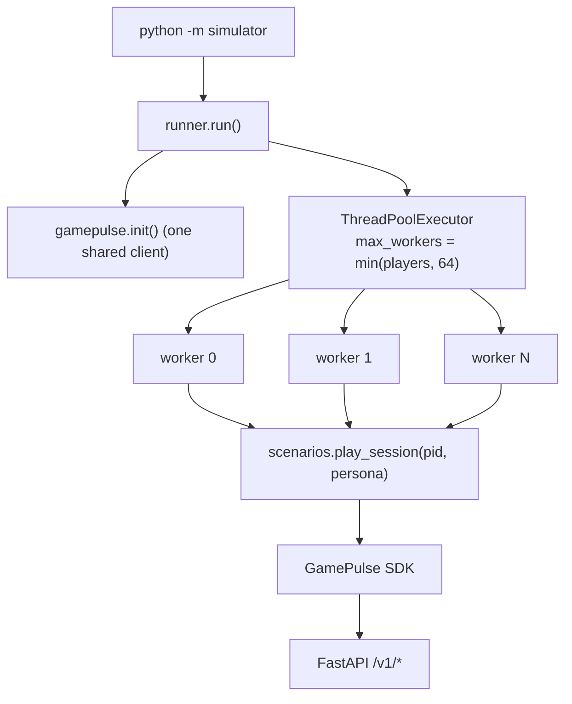

# Simulation System Design

The simulator (`packages/gamepulse-simulator`) generates realistic synthetic
telemetry so every dashboard page can be explored before a single real player has
launched the game. It is also the project's de-facto load generator: it drives the
**real SDK** against the **real API**, so it exercises the entire pipeline end to
end rather than inserting rows directly.

It can be invoked two ways:

- **From the dashboard** — the Simulation page calls a backend endpoint
  (`simulator_service.py`) that produces a week of backdated demo data.
- **From the terminal** — `python -m simulator --players N --duration S ...` runs
  the thread-pool driver below.

---

## Design

### Persona model

Each synthetic player is assigned one of four **personas**, a small dataclass
(`slots=True`) of behavioural probabilities:

| Persona | Crash/session | Rage-quit/session | Session length | Spend/level |
|---|---|---|---|---|
| `casual` | 1% | 3% | 1-4 s | 5% |
| `whale` | 2% | 1% | 3-8 s | 40% |
| `rage_quitter` | 2% | 30% | 0.5-2 s | 2% |
| `crasher` | 25% | 5% | 0.5-2 s | 5% |

The personas are tuned so the resulting dashboard tells a recognisable story: the
`crasher` cohort dominates the Crashes page, the `rage_quitter` cohort lights up the
Rage Quits page and its per-level frustration scores, and the `whale` cohort drives
IAP revenue on the Economy page.

### Scenario generation

`play_session()` is a probabilistic state machine. Per session it:

1. Calls `identify()` with the persona tag.
2. Optionally earns starting currency; whales occasionally fire an IAP purchase.
3. Opens a `gamepulse.session()` context and loops through levels until a randomised
   deadline, emitting `progression.start`, then branching to `complete` (with a
   weighted star rating and an occasional `economy.spend`) or `fail`.
4. Randomly injects crashes (`error.crash`) and rage quits (`error.rage_quit`) per
   the persona's probabilities, breaking out of the loop when they fire.

The branching weights (65% completion, weighted star distribution, level-scaled
rewards) are chosen to produce a realistic difficulty funnel rather than uniform
noise.

---

## Concurrency

The driver uses a `ThreadPoolExecutor` capped at `min(players, 64)` workers. Threads
(not processes) are the right primitive because each worker is **I/O-bound** on the
SDK's HTTP calls — the GIL is released during network waits, so threads achieve real
concurrency for this workload. All workers share a single initialised SDK client and
therefore a single background flush queue, so synthetic events are batched exactly
like production traffic.

A single `flush()` + `shutdown()` at the end guarantees the final partial batch is
delivered before the process exits.

---

## Complexity

`P` = number of players, `D` = run duration (seconds), `r` = average session rate
per player (a function of persona session length), `W` = worker cap (64).

| Aspect | Cost |
|---|---|
| Sessions generated | `O(P · D · r)` — proportional to players and wall-clock duration |
| Events per session | `O(levels_played)` — bounded by the per-session deadline |
| Wall-clock time | `~O(D)` — bounded by `duration_s`, not by `P` (workers run in parallel) |
| Memory | `O(W)` live workers + the SDK's bounded queue; independent of total events |
| Throughput ceiling | min(worker count, API rate limit, network) |

Because wall-clock time is bounded by the requested duration and parallelism is
capped at 64, the simulator's footprint is **constant in memory** regardless of how
many total events it produces — events stream out through the bounded SDK queue
rather than accumulating.

---

## Why drive the real SDK?

Generating data through the actual SDK and API (instead of bulk-inserting rows)
means the simulator validates:

- the SDK's batching, retry, and flush behaviour under sustained load,
- the API's idempotent ingest and rate limiting,
- the full event taxonomy and payload schemas,

so a successful simulation run is also a lightweight end-to-end integration test.
The `is_simulated` flag (see [Database Design](database-design.md)) keeps synthetic
data separable from real SDK data, so it can be filtered out of every analytics
query or deleted in bulk.

See [Performance & Complexity](performance.md) for how the simulator is used to
reason about backend scaling.
